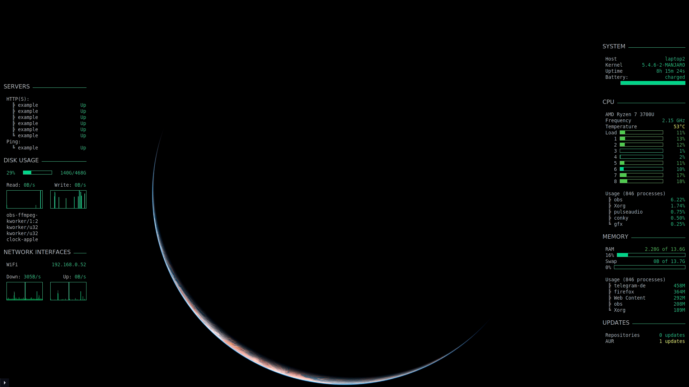

# conky-config

This my conky config. It is intended to be run on Manjaro and other Arch-based distros that use the pacman package manager.

On the left side, it shows the status of my servers, my disk usage (and IO read/write), and the local IPv4 as well as the current down- and upload usage for each interface (if the interface has a local IP).<br>
The server status will only be displayed if a file exists at `~/.config/conky/show_servers` and if its content is `on`. This means you can toggle the display of server status as follows:

Turn on:
```shell script
echo on > ~/.config/conky/show_servers
```

Turn off:
```shell script
echo off > ~/.config/conky/show_servers
# Or just delete the file
rm ~/.config/conky/show_servers
```

On the right side, it shows general system details, the battery status (which can be removed if you're using a desktop) as well as the remaining time to full charge or full discharge, CPU details, memory details and how many updates from official repos and the AUR are available.

Dependencies:
- `conky-lua-nv` (AUR/Manjaro repos) (`conky-lua` does NOT play well due to using a seperated lua version)
- `pacman-contrib` - For `checkupdates` script needed to get update count. *(Arch only! Manjaro only needs `pacman`)*
- `yay` (AUR/Manjaro repos) (for getting AUR update count) *[not needed if you don't use AUR packages]*

All files are intended to be located at `~/.config/conky/`. If you want a different path, you will have to change it in each file.


