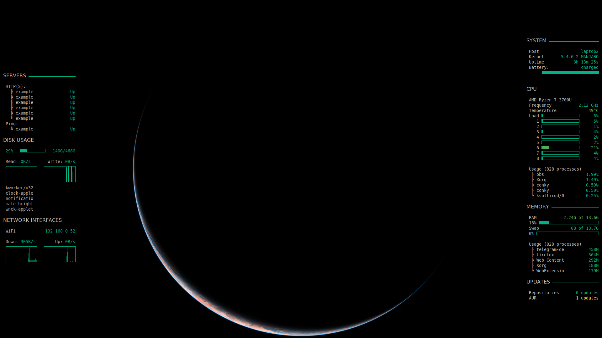

# conky-config

This my conky config. It is intended to be run on Manjaro and other Arch-based distros that use the pacman package manager.

On the left, it shows the status of my servers, my disk usage (and IO read/write), and the local IPv4 as well as the current down- and upload usage for each interface (if the interface has a local IP).

On the right, it shows general details, the battery status (which can be removed if you're using a desktop), CPU details, memory details and how many updates from official repos and the AUR are available.

Requirements:
- conky (duh)
- yay (optional, for updates)

All files are intended to be located at ~/.config/conky/. If you want a different path, you will have to change it in each file.

